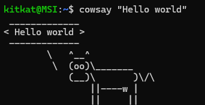

# PROJET COWSAY

## 1. Introduction
- Le projet Cowsay est un projet encadré dans le cadre du cours INF203, axé sur la commande `cowsay` disponible sur Linux. Ce projet nous a permis d'appliquer et d'approfondir nos connaissances en Bash et en langage C.
- Il y a 5 parties dans notre compte-rendu :
    - 1. **Introduction** : Cette partie présente le projet Cowsay, son objectif et son importance dans le cadre de notre cours. Nous expliquons également comment Cowsay peut être utilisé pour créer des dialogues amusants avec des vaches ASCII.
    - 2. **Préliminaires** : Nous introduisons la commande `cowsay` sur Linux et nous nous familiarisons avec ses options. Cette section nous permet de comprendre les fonctionnalités de base de `cowsay` et comment les utiliser pour personnaliser les dialogues des vaches.
    - 3. **Bash** : Nous explorons les différentes manières dont nous pouvons utiliser `cowsay` en combinaison avec Bash. Cette partie présente des exemples de scripts Bash qui utilisent `cowsay` pour afficher des messages amusants et informatifs, notamment en jouant avec des chiffres.
    - 4. **C** : Nous détaillons notre implémentation du projet Cowsay en langage C. En plus de recréer les fonctionnalités de base de `cowsay`, nous avons également introduit de nouvelles idées, telles que la création de nouvelles vaches.
    - 5. **Automates** : Enfin, nous avons développé un petit jeu qui utilise le projet Cowsay. Ce jeu met en pratique les compétences et connaissances en automates que nous avons acquises dans le cadre du cours d'INF203.
- Ce compte-rendu résume notre exploration et notre travail avec le projet Cowsay, mettant en lumière les différentes facettes de notre expérience, des aspects ludiques aux applications pratiques dans le cadre du cours INF203.

## 2. Préliminaires
Cowsay est un petit logiciel disponible sur Linux qui affiche un texte passé en argument dans une bulle de parole d’une vache ASCII.
### 2.1. Utilisation de commande 
Un example d'utilisation la commande cowsay:
~~~
cowsay "Hello world!"
~~~


### 2.2. Arguments de la commande
La commande cowsay prend plusieurs arguments. Voici une liste des arguments les plus couramment
utilisés :
- **-f**: Spécifie une vache différente. Par exemple, cowsay -f dragon-and-cow "Hello" affiche un dragon et un vache qui dit "Hello".
- **-l**: Affiche la liste des autres ASCII art disponibles pour utiliser avec l'option **-f**.
- **-e**: Modifie les yeux de la vache. Par exemple, cowsay -e @@ "Hello" affiche la vache avec des
yeux en forme d’arobase.
- **-T**: Modifie la langue de la vache. Par exemple, cowsay -T U "Hello" affiche la vache avec la
langue sortie.
- **-b**: Utilise une bulle de parole basse. Par exemple, cowsay -b "Hello" affiche la bulle de parole
en bas.
- **-W**: Définit la largeur de la bulle de parole. Par exemple, cowsay -W 40 "Hello" limite la largeur
à 40 caractères.
- **-d**: Modifie l’apparence de la vache pour la rendre triste.
- **-g**: Modifie l’apparence de la vache pour la rendre joyeuse.
- **-p**: Modifie l’apparence de la vache pour la rendre enroulée dans un drapeau.
- **-s**: Modifie l’apparence de la vache pour la rendre endormie.
- **-t**: Modifie l’apparence de la vache pour la rendre en train de penser.
- **-w**: Définit la largeur de la bulle de parole de manière automatique.
- **-y**: Modifie l’apparence de la vache pour la rendre regardant en haut.

## 3. Bash
### 3.1. Cow_kindergarten
#### 3.1.1. Description
- Le script `cow_kindergaten` affiche une vache qui prononce les chiffres à 1 de 10 avec une pause d'une seconde entre chaque chiffre. À la fin, la vache tirera la langue.
- Nous avons utilisé une boucle `for` pour compter de 1 à 10 et, pour chaque chiffre, nous avons utilisé la commande `cowsay` pour le prononcer. Enfin, nous avons utilisé l'option `-T` pour faire tirer la langue à la vache.
#### 3.1.2. Code
```
#!/bin/bash

clear #Efface l'ecran
for i in {1..9}
do 
    cowsay $i
    sleep 1s #Attend 1 seconde
    clear
done
cowsay -T U 10 #Affiche un vache qui tire la langue
```
### 3.2. Cow_primaryschool
#### 3.2.1. Description 
- Le script `cow_primaryschool` affiche une vache qui prononce les chiffres de 1 à n avec n un nombre donné en argument du script.
- Ce script est quasiment la même chose que précédemment sauf que cette fois, nous avons utilisé le nombre en argument pour que la vache le prononce. 
#### 3.2.2. Code
```
#!/bin/bash

if [ $# -ne 1 ]; then #On verifie si l'argument est valide
    echo "Erreur! Argument invalide!"
    exit 1
fi
clear 
a=$(expr $1 - 1)
for i in $(seq 1 $a) #On fait la boucle jusqu'a n-1 
do 
    cowsay $i
    sleep 1s
    clear
done
cowsay -T U $1 #La vache prononce le nombre n avec une langue
```
### 3.3. Cow_highschool
#### 3.3.1. Description 
- Le script `cow_highschool` affiche une vache qui prononce la suite des carrés $1, 4, 9, ...,n^2$ avec n un nombre donné en argument du script.
- Nous avons utilisé une boucle `while` pour calculer le carré à chaque itération, afin que la vache le prononce. La boucle s'arrête à n-1 et la vache prononce le nombre $n^2$ avec la langue tirée.
#### 3.3.2. Code
```
#!/bin/bash

if [ $# -ne 1 ]; then #On verifie si l'argument soit valide
    echo "Erreur! Argument invalide!"
    exit 1
fi
clear 
cpt=1 
carre=1 
stop=$(expr $1 \* $1)
while [ $carre -lt $stop ]
do
    cowsay $carre
    cpt=$(expr $cpt + 1) #cpt est le nombre avant caree pour la condition de la boucle
    carre=$(expr $cpt \* $cpt) #la vache affiche carre 
    sleep 1s
    clear
done
cowsay -T U $(expr $1 \* $1) #La vache affiche n caree avec une langue tiree
```
### 3.4. Cow_college
#### 3.4.1
- Ce script prend un argument $n$ et affiche la séquence de Fibonacci jusqu’à $n$, avec une pause d’une
seconde entre chaque nombre. À la fin, la vache tirera la langue.
- Ici, nous avons initialisé deux variables $x_1 = 1$ et $x_2 = 1$. Comme la suite Fibonacci est calculée par $x_3 = x_1+x_2$, dans la boucle while (qui s'arrête quand $x_2>n$), la vache prononce d'abord $x_1$. Ensuite, nous utilisons une variable $cpt = x_1$ pour conserver la valeur de $x_1$, où $x_1$ devient maintenant $x_2$ et $x_2 = x_2 + cpt$. Donc, quand $x_2 > n$, la boucle va s'arrêter et la vache va afficher $n$ ou un élément qui est le plus proche de $n$ avec la langue tirée.
#### 3.4.2. Code
```
#!/bin/bash

if [ $# -ne 1 ]; then #Verifie l'argument
    echo "Erreur! Argument invalide!"
    exit 1
fi
clear
x1=1 
x2=1
while [ $x2 -le $1 ]
do 
    cowsay $x1
    cpt=$x1
    x1=$x2
    x2=$(expr $cpt + $x2)
    sleep 1s
    clear
done
cowsay -T U $x1
```
### 3.5. Cow_college
#### 3.5.1. Description
- Ce script prend un argument $n$ et affiche une vache qui prononce les nombres premiers jusqu’à $n$, avec une pause d’une seconde entre chaque nombre premier. Et la vache tirera la langue à la fin.
- Tout d'abord, nous vérifions s'il y a un argument. Si non, le code affiche "Erreur" et s'arrête. Nous avons utilisé une boucle `for` pour rechercher les nombres premiers (nous cherchons les nombres naturels supérieurs à 1 qui n'est pas le produit de deux nombres naturels plus petits), puis nous les avons stockés dans un fichier `premiers.log`. Ensuite, nous avons utilisé ce fichier pour afficher une vache qui prononce les nombres premiers. Pour le dernier élément du fichier, la vache tire la langue lorsqu'elle le prononce. Et enfin, le fichier `premiers.log` est supprimé.
#### 3.5.2. Code 
```
#!/bin/bash

if [ $# -ne 1 ]; then #Verifie l'argument
    echo "Erreur! Argument invalide!"
    exit 1
fi
clear
cpt=2
for ((i=2; i<=$1; i++))
do
    prime=1
    for ((cpt=2; cpt<$i; cpt++))
    do
        if [ $((i % cpt)) -eq 0 ]
        then 
            prime=0
            break
        fi
    done
    if [ $prime -eq 1 ]; then
	echo $i >> premiers.log
    fi
done
ligne=$(wc -l < premiers.log)
for (( j=1; j<=$ligne; j++ ))
do
    clear #on met clear au debut de la boucle pour effacer l'ecran mais garder la vache a fin
    if [ $j -ne $ligne ]; then
	cowsay $(tail -n +$j premiers.log | head -n 1)
    else
	cowsay -T U $(tail -n +$j premiers.log | head -n 1)
    fi
    sleep 1s
done
rm -r premiers.log #on supprime le fichier qui contient les nombres premiers a la fin du programme
```
### 3.5. Smart_cow
#### 3.5.1. Description
- Le script prendra en argument une chaîne de caractères (par exemple "3+11") et retournera une vache qui prononce le calcul et dont les yeux se transforment en le résultat du calcul.
- Tout d'abord, nous vérifions s'il y a un argument. Si non, le code affiche "Erreur" et s'arrête. Nous avons utilisé `$(($1))` pour calculer le résultat. Si le résultat est inférieur à 10, nous ajoutons un 0 à gauche pour que la vache ait deux yeux. Sinon, la vache affiche l'opération avec le résultat comme ses yeux (Si le resultat a plus 2 caractères, 2 premières caractères devient les yeux de la vache). Si la chaîne de caractères n'est pas une opération mathématique, la vache affiche la chaîne de caractères avec les yeux par défaut.
#### 3.5.2. Code
```
#!/bin/bash

if [ $# -ne 1 ]; then
    echo "Erreur! Argument invalide!"
    exit 1
fi

expression="$1"

result=$(($1))

if [ $result -lt 10 ]
then
    cowsay -e "0$result" $1
else
    cowsay -e "$result" $1
fi
```
### 3.6. Cow_arithmetique
#### 3.6.1. Description
- Notre vache maintenant devient plus intelligent et peut calculer le nombre d'Euler assez précisément mais prend un peu de temps.
- En s'inspirant des cours de MAT203, il y a deux méthodes pour calculer le nombre d'Euler. On peut trouver $\lim_{n \to \infty} (1+\frac{1}{n})^x$ ou trouver $\sum_{n = 0}^{\infty} \frac{1}{n!}$. Ici, nous utilisons la deuxième méthode pour calculer le nombre d'Euler parce qu'elle est plus rapide et plus précise (on peut obtenir une approximation plus précise du nombre d'Euler avec un petit $n$). Le code prend en argument un nombre $n$, plus grand est $n$, plus précis est le résultat et plus de temps il faut pour calculer. Enfin, il affiche un animal disponible en cowsay (aléatoire) avec une approximation du nombre d'Euler.
#### 3.6.2. Code
```
#!/bin/bash

# Vérifie si l'argument soit valide
if [ $# -eq 0 ]; then
    echo "Invalid arguments"
    exit 1
fi

result=1
fact=1

for ((i=1; i<=$1; i++))
do
    fact=$(echo "scale=10; $fact * $i" | bc)
    result=$(echo "scale=10; $result + 1 / $fact" | bc)
done

cowsay -f $(ls /usr/share/cowsay/cows | shuf -n 1) "Approximation du nombre d'Euler avec n=$1: $result"
```

## 4. C
### 4.1 New_cow
#### 4.1.1 Description
- La vache de cowsay implémentée en C.
- Les options que l'on peut utiliser :
  + **-e**/**--eyes** avec une chaîne de deux caractères : Modifier les yeux de la vache.
  + **-d** : afficher une vache morte.
  + **-b** : le mode Borg (les yeux de la vache deviennent @@).
  + **-s** : la vache devient défoncée.
  + **-g** : le mode gourmand.
  + **-T** : modifier la langue de la vache.
  + **--t** : modifier la longueur de la taille.
#### 4.1.2. Code
```
#include <stdio.h>
#include <stdlib.h>
#include <string.h>

void affiche_vache(char *e, char *t, char *tail){
	printf(
"     ^__^\n\
     (%s)\\_______\n\
     (__)\\       )%s\n\
      %s  ||----w |\n\
         ||     ||\n",e,tail,t);
}

int strVint(char* c) {
    int len = strlen(c);
	int result =0;
    for (int i = 0; i < len; i++){
        result = result * 10 + ( c[i] - '0' );
    }
    return result;
}

int main(int argc, char**argv){
	char *eyes=malloc(10);
	char *tongue=malloc(10);
	char *tail=malloc(20);
	strcpy(eyes,"00");
	strcpy(tongue," ");
	strcpy(tail,"\\/\\");
	if (argc>=2){
		for (int i=1; i < argc; i++){
			if ((strcmp(argv[i], "-e")==0 || strcmp(argv[i], "--eyes")==0) && strcmp(eyes,"xx")!=0){
				strcpy(eyes,argv[i+1]);
			}
			else if (strcmp(argv[i], "-d")==0){
                strcpy(eyes,"xx");
				strcpy(tongue,"U");
			}
			else if (strcmp(argv[i], "-t")==0){
                strcpy(eyes,"--");
			}
			else if (strcmp(argv[i], "-b")==0){
                strcpy(eyes,"@@");
            }
			else if (strcmp(argv[i], "-s")==0){
                strcpy(eyes,"**");
            }
			else if (strcmp(argv[i], "-g")==0){
                strcpy(eyes,"$$");
            }
			else if (strcmp(argv[i], "-T")==0){
				tongue=argv[i+1];
			}
			else if (strcmp(argv[i], "--t")==0){
				int n = strVint(argv[i+1]);
				for (int j=0; j < n; j++){
					if (j%2==0){
						tail[j+1]='/';
					}
					else {
						tail[j+1]='\\';
					}
				}
				tail[n+1]='\0';
			}
		}
	}
	affiche_vache(eyes,tongue, tail);
	return 0;
}
```
### 4.2 Wild_cow
#### 4.2.1. Description
- Wild_cow est une vache animée.
- Il y a deux options:
    + **-v** est une vache qui saute par-dessus une clôture
    + **-t** est une dragon qui dance, cette animation est inspirée par le meme "Toothless dancing" et "cowsay -f dragon-and-cow"
#### 4.2.2. Code
```
#include <stdio.h>
#include <unistd.h>
#include <time.h>
#include <sys/time.h>
#include <string.h>


void update() {
    printf("\033[H\033[J");
}

void gotoxy(x, y) {
    printf("\033[%d;%dH",x,y);
}

int etat_cow (int i){
    if (i%2==0){
        return 0;
    }
    return 1;
}


void affiche_vache(){
	int x = 15;
    int y = 40;
    int etat;
	update();
	for (int i=0; i<40;i++){
        etat = etat_cow(i);
		if ( i >= 5 && i <= 29){
			etat = 1;
			if ( i >= 5 && i <= 8){
				x--;
			}
			else if ( i >= 26 && i <= 29){
				x++;
			}
			else if ( i > 8 && i <24){
				i++;
			}
		}
		gotoxy(16,30);
		printf(" _\n");
		gotoxy(17,30);
		printf("|_|\n");
		gotoxy(18,30);
		printf("|_|\n");
		gotoxy(19,30);
		printf("|_|\n");
	if (etat == 0){
		gotoxy(x,y-i);
		printf("^__^\n");
		gotoxy(x+1,y-i);
        	printf("(00)\\_______\n");
		gotoxy(x+2,y-i);
        	printf("(__)\\       )\\/\\\n");
		gotoxy(x+3,y-i);
		printf("    ||----w |\n");
		gotoxy(x+4,y-i);
		printf("    ||     ||\n");
        }
	else if (etat == 1){
		gotoxy(x,y-i);
		printf("^__^\n");
		gotoxy(x+1,y-i);
        	printf("(00)\\_______   /\n");
		gotoxy(x+2,y-i);
        	printf("(__)\\       )\\/\n");
		gotoxy(x+3,y-i);
		printf("    //----w \\\n");
		gotoxy(x+4,y-i);
                printf("   //        \\\n");
    }
	usleep(250000);
	update();
	}
	gotoxy(x,y-40);
	printf("^__^\n");
	gotoxy(x+1,y-40);
		printf("(--)\\_______\n");
	gotoxy(x+2,y-40);
		printf("(__)\\       )\\/\\\n");
	gotoxy(x+3,y-40);
	printf("    ||----w |\n");
	gotoxy(x+4,y-40);
	printf("    ||     ||\n");
    usleep(500000);
    update();
	gotoxy(x-2,y-40);
	printf("     < Phew! >\n");	
	gotoxy(x-1,y-40);
	printf("      /\n");
	gotoxy(x,y-40);
	printf("^__^\n");
	gotoxy(x+1,y-40);
		printf("(@@)\\_______\n");
	gotoxy(x+2,y-40);
		printf("(__)\\       )\\/\\\n");
	gotoxy(x+3,y-40);
	printf(" U  ||----w |\n");
	gotoxy(x+4,y-40);
	printf("    ||     ||\n");
}


void affiche_toothless(){
    update();
        printf(
"                       _^____^_0_0_\n\
                        s ________3_)\n\
                         |   |\n\
                      _  |   |  _\n\
                       | |   | |\n\
                        \\|   |/            \\__/     /\n\
                    0_   |   |             (oo)____/\n\
                      \\__|   |             (--)    )\n\
                         / /\\\\                //__\\\\\n\
                        C_|  |_3             //    \\\\\n"
            );
	update();
	sleep(1);
	printf(
"                       _^____^_0_0_\n\
                        s ________3_)\n\
                         |   |   \\0\\0\n\
                      _  |   |  _\n\
                       | |   | |\n\
                        \\|   |/            \\__/     /\n\
                    0_   |   |             (oo)____/\n\
                      \\__|   |             (--)    )\n\
                         / /\\\\                //__\\\\\n\
                        C_|  |_3             //    \\\\\n"
            );
	update();
	sleep(1);
	printf(
"                       _^____^_0_0_\n\
                        s ________3_)\n\
                         |   |   \\0\\0\n\
                      _  |   |  _ \\0\\0\\0\\0\n\
                       | |   | |\n\
                        \\|   |/            \\__/     /\n\
                    0_   |   |             (oo)____/\n\
                      \\__|   |             (--)    )\n\
                         / /\\\\                //__\\\\\n\
                        C_|  |_3             //    \\\\\n"
            );
	update();
	sleep(1);
	printf(
"                       _^____^_0_0_\n\
                        s ________3_)\n\
                         |   |   \\0\\0\n\
                      _  |   |  _ \\0\\0\\0\\0\n\
                       | |   | |   \\0\\0\\0\\0\\0\n\
                        \\|   |/            \\__/     /\n\
                    0_   |   |             (xx)____/\n\
                      \\__|   |             (--)    )\n\
                         / /\\\\      Ack!__/   //__\\\\\n\
                        C_|  |_3             //    \\\\\n"
            );
	update();
	sleep(1);
    for (int i = 0; i<5;i++){
        update();
        printf(
"                        _^____^_0_0_\n\
                         s ________3_)\n\
                          |   |\n\
                       _  |   |  _\n\
                        | |   | |\n\
                         \\|   |/\n\
                     0_   |   |\n\
                       \\__|   |\n\
                          / /\\\\\n\
                         C_|  |_3\n"
            );
        update();
        usleep(250000);
        printf(
"                         ^____^\n\
                         s\\   \\\n\
                         | 0   0\n\
                         |  (-3-)\n\
                      __ |   | __\n\
                        \\|   |/\n\
                    0_   |   |\n\
                      \\__|   |\n\
                         // \\\\\n\
                        C_| |_3\n"
            );
        update();
        usleep(250000);
        printf(
"                         ^___^\n\
                         |   |\n\
                         0-_-0\n\
                       | |   | |\n\
                       | |   | |\n\
                        \\|   |/\n\
                         |   |  0\n\
                         |   |_/\n\
                         |   |\n\
                         || ||\n"
            );
        update();
        usleep(250000);
            printf(
"                       ^____^\n\
                       /   /s\n\
                      0   0 |\n\
                     (-c-)  |\n\
                     __ |   | __\n\
                       \\|   |/\n\
                        |   |   _0\n\
                        |   |__/\n\
                        // \\\\\n\
                       C_| |_3\n"
            );
        update();
        usleep(250000);
        printf(
"                 _0_0_^____^_\n\
                (_c________ s\n\
                       |   |\n\
                    _  |   |  _\n\
                     | |   | |\n\
                      \\|   |/\n\
                       |   |   _0\n\
                       |   |__/\n\
                       // \\\\\n\
                      C_| |_3\n"
            );
        update();
        usleep(250000);
            printf(
"                       ^____^\n\
                       /   /s\n\
                      0   0 |\n\
                     (-c-)  |\n\
                     __ |   | __\n\
                       \\|   |/\n\
                        |   |   _0\n\
                        |   |__/\n\
                        // \\\\\n\
                       C_| |_3\n"
            );
        update();
        usleep(250000);
        printf(
"                         ^___^\n\
                         |   |\n\
                         0-_-0\n\
                       | |   | |\n\
                       | |   | |\n\
                        \\|   |/\n\
                         |   |  0\n\
                         |   |_/\n\
                         |   |\n\
                         || ||\n"
            );
        update();
        usleep(250000);
        printf(
"                         ^____^\n\
                         s\\   \\\n\
                         | 0   0\n\
                         |  (-3-)\n\
                      __ |   | __\n\
                        \\|   |/\n\
                    0_   |   |\n\
                      \\__|   |\n\
                         // \\\\\n\
                        C_| |_3\n"
            );
        update();
        usleep(250000);
        printf(
"                        _^____^_0_0_\n\
                         s ________3_)\n\
                          |   |\n\
                       _  |   |  _\n\
                        | |   | |\n\
                         \\|   |/\n\
                     0_   |   |\n\
                       \\__|   |\n\
                          / /\\\\\n\
                         C_|  |_3\n"
            );
    }   
    
}


int main(int argc, char* argv[]) {
    if (argc != 2) {
        printf("Invalid arguments");
        return 1;
    }
    if (strcmp(argv[1],"-v")==0){
        affiche_vache();
    }
    else if (strcmp(argv[1],"-t")==0){
        affiche_toothless();
    }
    else {
        printf("Invalid arguments");
        return 1;
    }
    return 0;
}
```
### 4.3. Reading_cow
#### 4.3.1. Description
- `reading_cow.c` prend comme argument un fichier ou lit depuis l'entrée standard (stdin) et fait lire le fichier à la vache, caractère par caractère : chaque caractère apparaîtra alors successivement dans la gueule de la vache et sera “avalé”, puis placé à la suite des caractères déjà avalés dans la bulle de texte. Une seconde se passera entre chaque caractère affiché.
- Nous divisons en 3 fonctions. La fonction `affiche_vache(char* phrase, char tongue)` prend comme arguments deux caractères, un pour la bulle de texte et l'autre pour la langue. La fonction `readcow(FILE *f)` lit depuis un fichier et donne les arguments à la fonction `affiche_vache` pour afficher la vache qui lit. Enfin, la fonction `read_stdin()` ne prend pas d'argument, et nous l'utilisons lorsqu'il n'y a pas d'argument dans le programme principal pour lire depuis l'entrée standard. Le nombre maximum de caractères que la vache peut lire est de 1024.
#### 4.3.2. Code
```
#include <stdio.h>
#include <ctype.h>
#include <string.h>
#include <unistd.h>

#define NBMOTSMAX 1024

void update() {
    printf("\033[H\033[J");
}

void affiche_vache(char* phrase, char tongue){
	char signal[strlen(phrase)+1];
	for (int i = 0; phrase[i] != '\0'; i++){
		signal[i]= '-';
	}
	signal[strlen(phrase)] = '\0';
	if (isspace(tongue)){ tongue = ' ';}
        printf(
" %s\n\
<%s>\n\
 %s\n\
	\\    ^__^\n\
	 \\   (oo)\\_______\n\
	     (__)\\       )\\/\\\n\
	      %c  ||----w |\n\
	         ||     ||\n",signal, phrase, signal, tongue);
}

void readcow (FILE *f){ // Cette fonction affiche une vache qui lit un fichier
	// update();
	char c;
	char s[NBMOTSMAX];
	int i = 0;
	s[i++] = ' ';
	fscanf(f, "%c", &c) ;
	s[i++]=c;
	fscanf(f, "%c", &c) ;
	while (!feof(f)){
		update();
		s[i]=' ';
		s[i+1]='\0';
		affiche_vache(s,c);	
		sleep(1);
		s[i++]=c;
		fscanf(f, "%c", &c) ;
	}
}

void read_stdin(){ // Cette fonction affiche une vache qui lit l'entree standard stdin
	char c;
	char s[NBMOTSMAX];
	int i = 0;
	s[i++] = ' ';
	scanf("%c",&c);
	update();
	while(c !=EOF){
		if (c == '\n' ){
			i=0;
			s[i++] =' ';
		}
		else{
			s[i++]=c;
		}
		s[i]=' ';
		s[i+1]='\0';
		scanf("%c",&c);
		affiche_vache(s,c);
		sleep(1);
		if (c!='\n'){
			update();}	
	}
}

int main(int argc, char* argv[]){
	FILE *f;
	if (argc > 2){
		printf("Invalid arguments");
		return 1;
	}
	else if (argc == 2){
		f = fopen(argv[1],"r");
		if (f == NULL){
			printf("%s n'a pas pu être ouvert en lecture\n", argv[1]);
			return 1;
		}
		readcow(f);
		fclose(f);
	}

	else{
		read_stdin();
	}
    return 0;
}
```
# 5. Automates
## 5.1. Description
- Le jeu tamagoshi_cow permet aux utilisateurs de nourrir une vache virtuelle et de gérer sa santé afin de la maintenir en vie le plus longtemps possible.
- L'état de santé de la vache (fitness) peut fluctuer en réponse à la nourriture consommée (lunchfood) et à d'autres facteurs simulés (digestion).
- L'état de la vache peut être l'un des trois suivants: BYEBYELIFE (la vache est décédée), LIFESUCKS (la vache ne se sent pas bien), ou LIFEROCKS (la vache est en pleine forme).
- Le joueur doit gérer une réserve de nourriture (stock), qui change également en fonction de la nourriture consommée et de la qualité de la nourriture stockée (crop).
- Les utilisateurs ne voient que l'état visuel de la vache et la quantité de nourriture restante, sans connaître le niveau exact de santé ou la quantité de nourriture dans la réserve.

## 5.2. Code
```
#include <stdio.h>
#include <stdlib.h>
#include <string.h>
#include <time.h>
#define BYEBYELIFE 0
#define LIFESUCKS 1
#define LIFEROCKS 2

int stock = 5;
int fitness = 5;

void affiche_vache(int etat){
	char e[3] = "00";
    char t[3] = " ";
    char words[50];  
    char signal[50];
	if (etat==BYEBYELIFE){
		strcpy(e,"xx");
		strcpy(t, "U");
		strcpy(words,"Je suis MORT!!!");
	}
	else if (etat==LIFESUCKS){
		strcpy(e,"@@");
		strcpy(words,"Je suis pas bon!");
	}
	else if (etat==LIFEROCKS){
		strcpy(words,"Let's GOOOOO!!!!");
	}
	for (int i=0; i<strlen(words)+2; i++){
		signal[i]='-';
	}
        printf(
" %s\n\
< %s >\n\
 %s\n\
	\\    ^__^\n\
	 \\   (%s)\\_______\n\
	     (__)\\       )\\/\\\n\
	      %s  ||----w |\n\
	         ||     ||\n",signal, words, signal, e, t);
}

int stock_update(int lunchfood){
	time_t t;
	srand((unsigned) time(&t));
	int crop;
	crop = rand() % 7;
	crop -= 3;
	while (((stock - lunchfood)+crop > 10) || ((stock - lunchfood)+crop <= 0)){
		crop = rand() % 7;
        	crop -= 3;
	}
	return (stock - lunchfood)+crop;;
}

int fitness_update(int lunchfood){
        time_t t;
        srand((unsigned) time(&t));
        int digestion;
        digestion = rand() % 4;
        digestion = -digestion;
        fitness = (fitness+lunchfood)+digestion;
        if (fitness > 10) {
            fitness=10;
        }
        else if (fitness < 0){
            fitness = 0;
        }
        return fitness;;
}


int etat_vache(int fitness){
	if (fitness == 0 || fitness == 10){
		return BYEBYELIFE;
	}
	else if ((fitness >=1 && fitness <=3) || (fitness >=7 && fitness <= 9)){
		return LIFESUCKS;
	}
	//else if ((fitness >=4 && fitness <= 6)){
	return LIFEROCKS;
	//}
}


void update () { printf ("\033[H\033[J");}
int main(){
	int time = 0;
	int etat;
	int lunchfood;
	etat = etat_vache(fitness);
	while (etat != BYEBYELIFE){
		update();
		affiche_vache(etat);
		printf("Stock: %d\n", stock);
		printf("Nourriture? (<=%d) ", stock);
		scanf("%d", &lunchfood);
		while (lunchfood > stock || lunchfood <=0 ){
			printf("Veuillez retaper, svp ");
			scanf("%d", &lunchfood);
		}
		fitness = fitness_update(lunchfood);
		stock = stock_update(lunchfood);
		etat = etat_vache(fitness);
		time++;
	}
	printf("La vache a %d ans", time);
	return 0;
}

```